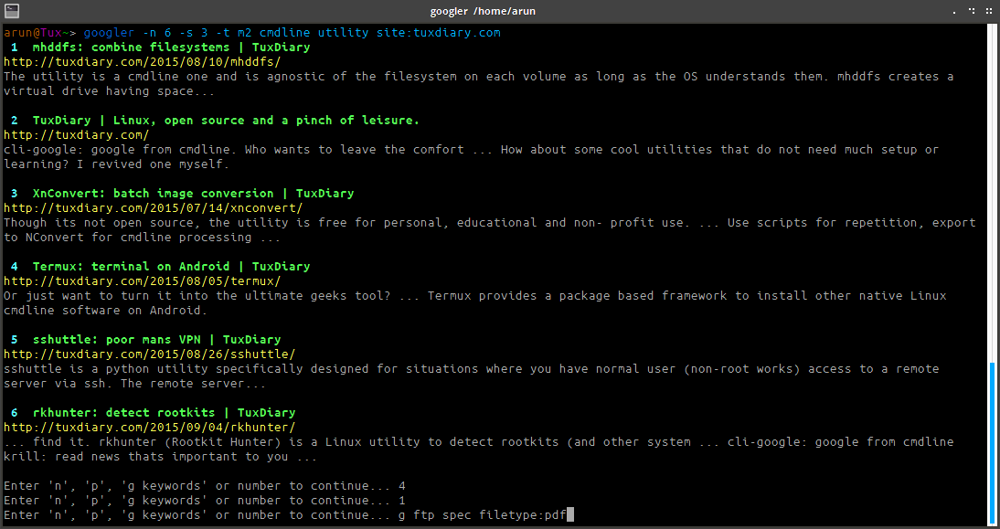

# google-cli

Copyright (C) 2008 Henri Hakkinen

Modified (2015) by Arun Prakash Jana &lt;engineerarun@gmail.com&gt;

`google-cli` is a command line tool to search Google from the terminal. It shows the title, URL and text context for each result. Results are fetched in pages. Next or previous page navigation is possible using keyboard shortcuts. Results are indexed and a result URL can be opened in a browser using the index number.
  
`google-cli` is GPLv3 licensed.

# Features

> - Uses HTTPS connection
> - Fetch n results in a go
> - Start at nth result
> - Fetch and navigate next or previous set of results
> - Easily open result URLs in browser from cmdline using index number
> - Show full contextual text snippet in search results
> - Specify search duration (in hours / days / weeks / months / years)
> - Fetch results from Google News section
> - Country/domain specific search (28 top-level domains supported, default: .com)
> - Filetype specific search 
> - Optionally open the first result directly in browser (as in <i>I'm Feeling Lucky</i>)
> - Specify language preference for results
> - Handle first level of Google redirections (reports IP blocking by Google)
> - Unicode in URL works
> - UTF-8 request and response
> - Works with Python 2.7.x and 3.x
> - Enable/disable color output (default: colorful)
> - Enable/disable debug logs (default: disabled)
> - Manpage for quick reference
> - Fast and clean (no ads or clutter)
> - Minimal dependencies
> - Open source and free

# Usage

<pre>Usage: google [OPTIONS] KEYWORDS...
Options
    -s N     start at the Nth result
    -n N     show N results (default 10)
    -N       show results from news section
    -c SERV  country-specific search (Ref: https://en.wikipedia.org/wiki/List_of_Google_domains)
             Added TLDs: ar, au, be, br, ca, ch, cz, de,
             es, fi, fr, id, in, it, jp, kr, mx, nl, ph,
             pl, pt, ro, ru, se, tw, ua, uk
    -l LANG  display in language LANG, such as fi for Finnish
    -C       disable color output
    -j       open the first result in a web browser
    -f MIME  search for specific file type
    -t dN    time limit search [h5 (5 hrs), d5 (5 days), w5 (5 weeks), m5 (5 months), y5 (5 years)]
    -d       enable debugging

Keys
    n, p     press 'n' or 'p' and Enter to navigate forward and backward
    1-N      press a number and Enter to open that result in browser</pre>

<b>Configuration file</b>  
  
google-cli doesn't have any! This is to retain the speed of the utlity and avoid OS-specific differences. Users can enjoy the advantage of config files using aliases. There's no need to memorize options.  
  
For example, the following alias set in `~/.bashrc`:
<pre>alias g='google -n 7 -c ru -l ru'</pre>
fetches 7 results from the Google Russia server, with preference towards results in Russian.  
  
The alias serves both the purposes of using config files:
- persistent settings: when the user invokes `g`, it expands to the preferred settings everytime.
- override settings: thanks to the way Python getopt() works, google-cli is written so that the settings in alias are completely overridden by any options passed from cli. So when the same user runs:  
<code>$ g -l de -c de -n 12 hello world</code>  
12 results are returned from the Google Germany server, with preference towards results in German.
  
Windows users can refer the following discussion on how to use aliases on Windows:
http://stackoverflow.com/questions/20530996/aliases-in-windows-command-prompt

# Examples

1. Google <b>hello world</b>:
<pre>$ google hello world</pre>
2. To fetch <b>15 results</b> updated within last <b>14 months</b>, starting from the <b>3rd result</b> for the string <b>cmdline utility</b> in <b>site</b> tuxdiary.com, run:
<pre>$ google -n 15 -s 3 -t m14 cmdline utility site:tuxdiary.com</pre>
3. Read recent <b>news</b> on gadgets:
<pre>$ google -N gadgets</pre>
4. Fetch results on IPL cricket from <b>Google India</b> server in <b>English</b>:
<pre>$ google -c in -l en IPL cricket</pre> 
5. Search <b>mp3</b> instrumental music:
<pre>$ google -f mp3 instrumental</pre>
6. Search quoted text e.g. <b>it's a "beautiful world" in spring</b>:
<pre>$ google it\'s a \"beautiful world\" in spring</pre>
7. On the fly <b>help</b> (usage details):
<pre>$ google</pre>

# Installation

google-cli requires Python 2.7.x or Python 3.x to work.

The following steps are tested on Ubuntu 14.04.3 x64_64:  
<pre>$ git clone https://github.com/jarun/google-cli/  
$ cd google-cli  
$ sudo make install</pre>  

To remove, run:  
<pre>$ sudo make uninstall</pre>

# News

>**31 Aug, 2015**
> - Google News support
> - Fix failure to open URL with " (double quotes) in browser
> - Fix version information in manpage
> - Get rid of Google Chrome debug/error messages in console when opening URL

>**30 Aug, 2015**
> - Reformat country/domain specific search code. 28 domains supported now
> - Add switch for debug logs

>**28 Aug, 2015**
> - Support country-specific search (Open to additions on request)

>**27 Aug, 2015**
> - Time limit search by hours

>**26 Aug, 2015**
> - Open result in browser using index number (thanks jeremija) 
> - Convert %22 to " (double quote) in URLs
> - Inputs other than n, p or number (+ Enter) exit

>**25 Aug, 2015**
> - Add Python 3.x support (thanks Narrat)
> - Add UTF-8 request and response (thanks Narrat)

>**22 Aug, 2015**
> - Add navigation support

>**17 Aug, 2015**
> - Support for time limited search  
> - Throw error in case of google error due to unusual activity from IP  
> - Support file type in search

>**16 Aug, 2015**
> - Use https  
> - Handle google redirections (error 302)
> - Show full text snippet of search results
> - Unicode in URL works
> - Colour output by default, -C now disables it (toggled)
> - The first URL now correctly opens in browser with -j switch
> - Honour -j even if -n is not used and open the result in browser
> - Fixed character encoding problem in URL e.g. double quotes (%22) changed to %2522
> - Skip browser to show result in console for empty URL, e.g., first result of ‘define hello’

# Note

Initially I raised a pull request but I could see that the last change was made 7 years earlier. In addition, there is no GitHub activity from the original author (Henri Hakkinen: https://github.com/henux ) in past year. I have created this independent repo for the project with the name google-cli. Would love to push the changes back to original repo if the author contacts. I retained the original copyright information.
